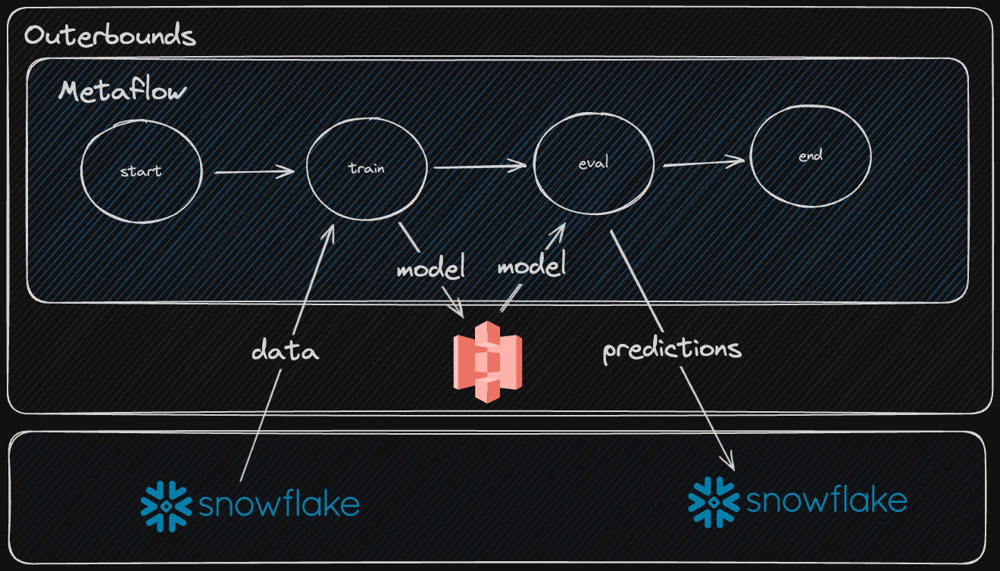

## Setup

### Create the environment
```bash
mamba env create -f env.yml
```

### Activate the environment 
```bash
mamba activate metaflow-snowflake-xgb-example
```

### Create the demo DB in Snowflake
In a Snowflake SQL worksheet, run the queries in `setup-preds-db.sql`.

## Run the flow
```bash
python flow.py --environment=conda run
```